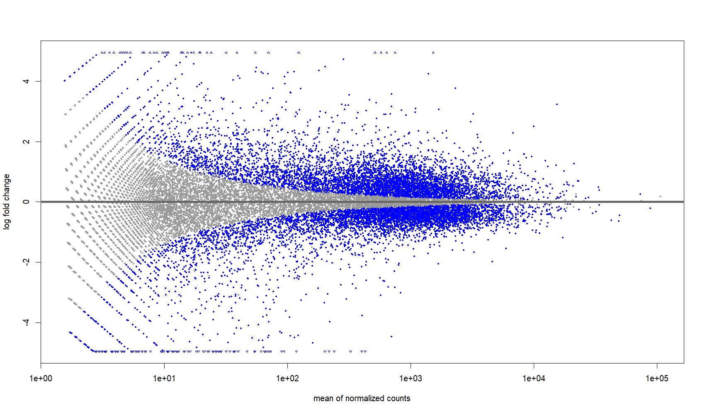
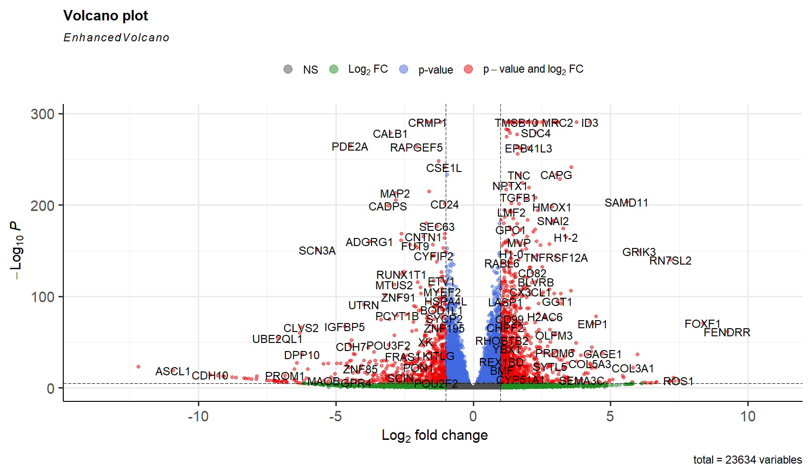
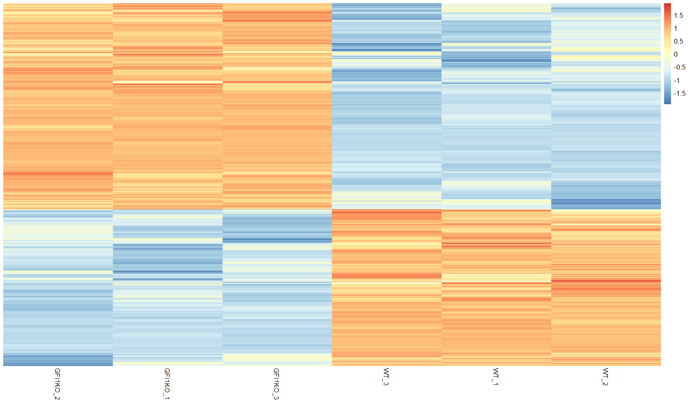
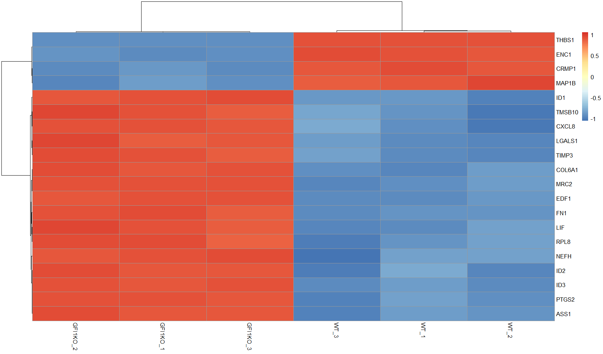
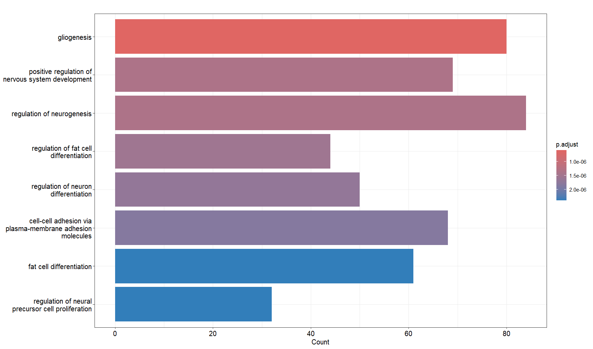
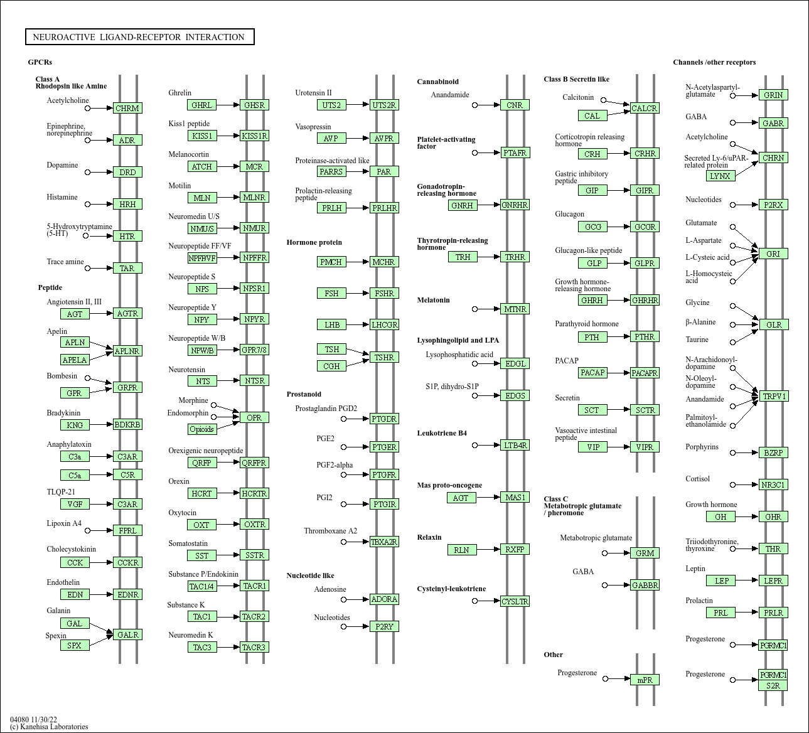

# RNAseq Analysis Project

A complete RNA sequencing analysis pipeline — from raw reads to differential expression and pathway enrichment.

## Overview

RNA sequencing (RNAseq) is a powerful technique for profiling gene expression. This project includes a complete pipeline for processing RNAseq data, from quality control to differential expression analysis.

The dataset used in this project is RNAseq data from [GSE165308](https://www.ncbi.nlm.nih.gov/geo/query/acc.cgi?acc=GSE165308), sourced from the NCBI Gene Expression Omnibus (GEO) database. The dataset includes a total of 6 samples, representing both GFI1 knockout and control conditions.

All raw reads were processed using quality control tools such as FastQC, and alignment was performed using STAR, followed by gene quantification using featureCounts. Differential gene expression analysis was carried out using the `DESeq2` package in R. Gene Ontology (GO) and KEGG pathway enrichment analyses were also performed using the `clusterProfiler` package in R.

## Project Structure

```
RNAseq-analysis/
├── scripts/
│   ├── config.sh              # All configurable paths and parameters
│   ├── genome_setup.sh        # One-time genome download & STAR index
│   ├── rnaseq_pipeline.sh     # Main pipeline (QC, trimming, alignment, counting)
│   ├── deseq2_pipeline.R      # Differential expression analysis
│   └── go_and_kegg_pathway.R  # GO & KEGG pathway enrichment
├── datasets/
│   ├── gene_counts.csv
│   ├── deseq.csv
│   └── res_and_normalized.csv
└── images/
    ├── deseq/
    └── go_and_kegg_pathway/
```

## Prerequisites

### Bioinformatics Tools

| Tool | Description | Installation |
|------|-------------|-------------|
| [FastQC](https://www.bioinformatics.babraham.ac.uk/projects/fastqc/) | Quality control of raw sequencing data | `sudo apt-get install fastqc` |
| [MultiQC](https://github.com/MultiQC/MultiQC) | Aggregates QC results into a single report | `sudo apt-get install multiqc` |
| [Trimmomatic](http://www.usadellab.org/cms/index.php?page=trimmomatic) | Trimming and cleaning sequencing reads | `sudo apt-get install trimmomatic` |
| [SRA Toolkit](https://github.com/ncbi/sra-tools) | Accessing data from NCBI SRA | `sudo apt-get install sra-toolkit` |
| [STAR](https://github.com/alexdobin/STAR) | Aligning RNAseq reads to a reference genome | See below |
| [featureCounts](https://subread.sourceforge.net/featureCounts.html) | Quantifying reads mapped to genomic features | `sudo apt-get install subread` |

**STAR installation:**
```bash
git clone https://github.com/alexdobin/STAR.git
cd STAR/source
make
```

### R Packages

```R
install.packages(c("tidyverse", "ggplot2", "pheatmap"))
install.packages("BiocManager")
BiocManager::install(c("DESeq2", "clusterProfiler", "EnhancedVolcano", "org.Hs.eg.db"))
```

## Installation & Configuration

```bash
git clone https://github.com/tarik-kirlioglu/RNAseq-analysis.git
cd RNAseq-analysis
```

Before running the pipeline, edit `scripts/config.sh` to set the paths for your system:

```bash
BASE_DIR="/path/to/your/working/directory"
TRIMMOMATIC_JAR="/path/to/trimmomatic.jar"
TRIMMOMATIC_ADAPTERS="/path/to/adapters/TruSeq3-PE-2.fa"
THREADS=8
```

## Analysis Workflow

### Step 0 — Genome Setup (one-time)

Download the reference genome, GTF annotation, and build the STAR index:

```bash
bash scripts/genome_setup.sh
```

### Step 1 — Main Pipeline

Run the full pipeline (prefetch, QC, trimming, alignment, counting):

```bash
bash scripts/rnaseq_pipeline.sh
```

Pipeline steps:
1. **Prefetch** — Download SRA datasets
2. **FastQC** — Quality control of raw reads
3. **MultiQC** — Aggregate QC reports
4. **Trimming** — Clean reads with Trimmomatic
5. **Alignment** — Map reads to reference genome with STAR
6. **Quantification** — Count reads with featureCounts

### Step 2 — Differential Expression Analysis

Run the DESeq2 pipeline in R:

```R
source("scripts/deseq2_pipeline.R")
```

### Step 3 — GO & KEGG Pathway Analysis

```R
source("scripts/go_and_kegg_pathway.R")
```

## Results

### MA Plot


### Volcano Plot


### Heatmap — Significant Genes


### Heatmap — Top 20 Genes


### GO Enrichment


### KEGG Pathway


## Contributions

Contributions are welcome! Feel free to fork this repository and submit pull requests. For major changes, please open an issue first to discuss your proposed changes.

## Contact

If you have any questions or suggestions please feel free to contact me.
